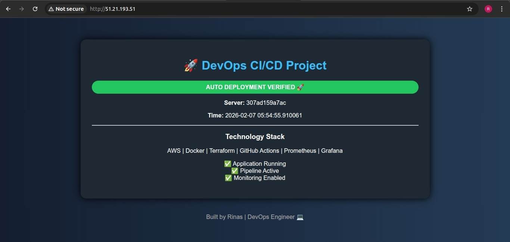
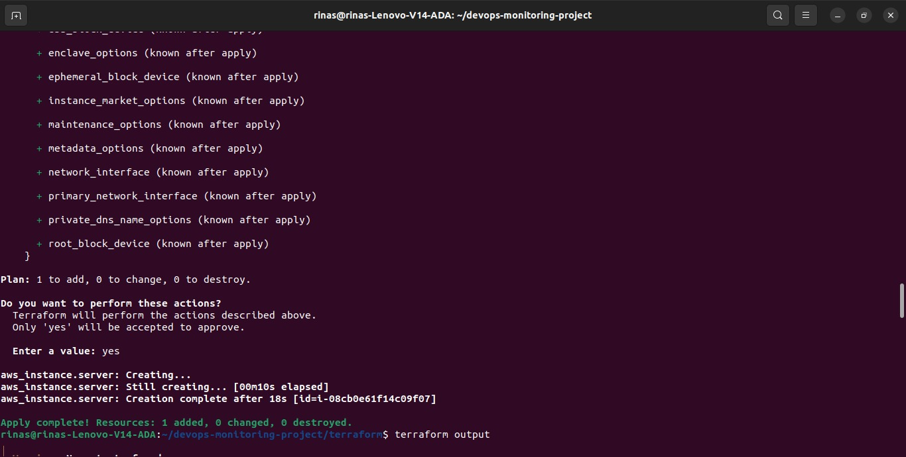
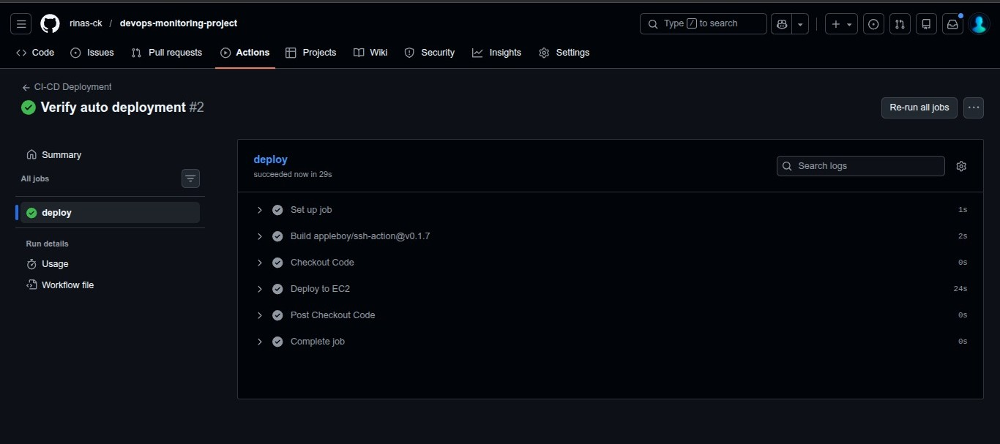
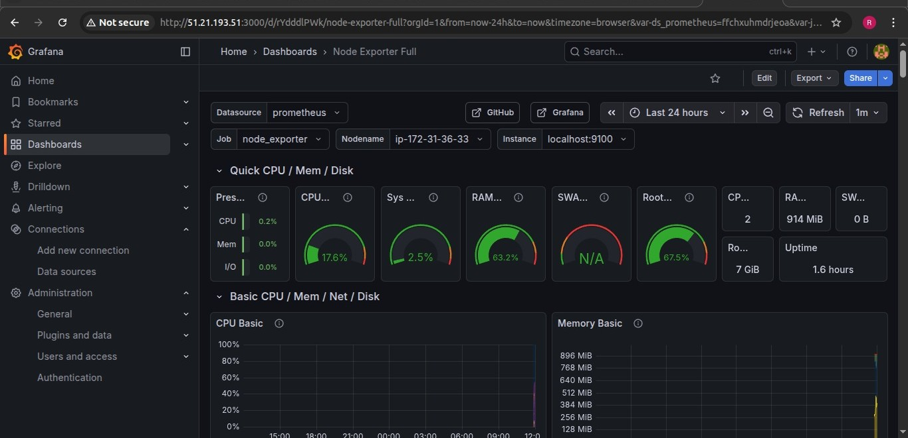
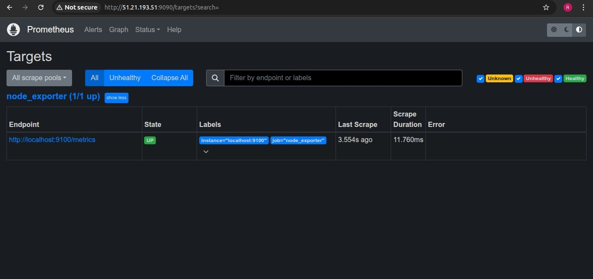

# 🚀 Production-Grade DevOps CI/CD Project on AWS

A complete DevOps project demonstrating automated infrastructure provisioning, CI/CD pipelines, containerized deployment, and real-time monitoring using modern cloud-native tools.

---

## 📌 Project Overview

This project implements an end-to-end DevOps workflow where:

- Infrastructure is provisioned using Terraform
- Application is containerized with Docker
- CI/CD pipeline is automated using GitHub Actions
- Application is deployed on AWS EC2
- Monitoring is enabled using Prometheus & Grafana

All deployments are fully automated and verified through pipelines.

---

## 🏗️ Architecture

Developer → GitHub → GitHub Actions → Docker Hub → AWS EC2 → Flask App  
                                                     ↓  
                                             Prometheus + Grafana

---

## ⚙️ Tech Stack

| Category | Tools |
|----------|--------|
| Cloud | AWS (EC2) |
| IaC | Terraform |
| CI/CD | GitHub Actions |
| Container | Docker |
| Backend | Flask (Python) |
| Monitoring | Prometheus, Grafana |
| Metrics | Node Exporter, cAdvisor |

---

## 🚀 Features

✅ Automated CI/CD Pipeline  
✅ Infrastructure as Code (Terraform)  
✅ Dockerized Application  
✅ Auto Deployment on EC2  
✅ Monitoring with Prometheus & Grafana  
✅ Health & Performance Tracking  
✅ Real-time Dashboard  

---

## 📂 Project Structure

```
devops-monitoring-project/
│
├── .github/workflows/
├── terraform/
├── app.py
├── Dockerfile
├── requirements.txt
└── README.md
```

---

## 🔄 CI/CD Workflow

1. Code pushed to GitHub  
2. GitHub Actions triggered  
3. Build Docker image  
4. Push to Docker Hub  
5. SSH into EC2  
6. Pull latest image  
7. Deploy container  
8. Restart services  
9. Verify deployment  

---

## ☁️ Infrastructure Setup (Terraform)

```
cd terraform
terraform init
terraform plan
terraform apply
```

Creates EC2, Security Groups, and Networking resources.

---

## 🐳 Docker Setup

Build image:

```
docker build -t devops-app .
```

Run container:

```
docker run -d -p 80:5000 devops-app
```

---

## 📊 Monitoring Setup

### Prometheus
- Collects metrics from Node Exporter and cAdvisor

### Grafana
- Visualizes CPU, Memory, Disk, Network, and Container metrics

---

## 📸 Project Screenshots


Screenshots of the architecture, monitoring dashboards, live app and cicd are available in the `/screenshots` folder.
---

### Architecture Diagram


### Live-app


### Terraform-apply


### GitHub-actiom


### Grafana


### Prometheus 



## ✅ Deployment Verification

Deployment page displays:

- Server ID
- Timestamp
- Pipeline Status
- Monitoring Status

This confirms successful automation.

---

## 🎯 Learning Outcomes

- End-to-end CI/CD implementation  
- AWS automation with Terraform  
- Docker containerization  
- Monitoring & alerting  
- Production deployment  
- DevOps best practices  

---

## 👨‍💻 Author

**Rinas CK**  
DevOps Engineer  

GitHub: https://github.com/rinas-ck  
LinkedIn: https://linkedin.com/in/rinas-ck

---

## ⭐ Support

If you like this project, please give it a ⭐ on GitHub!
